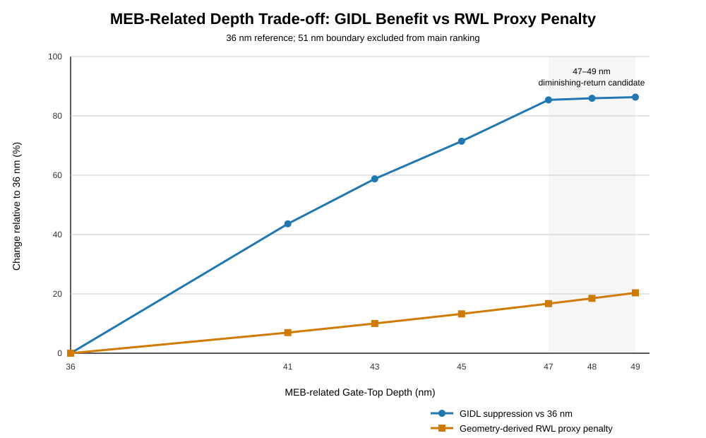
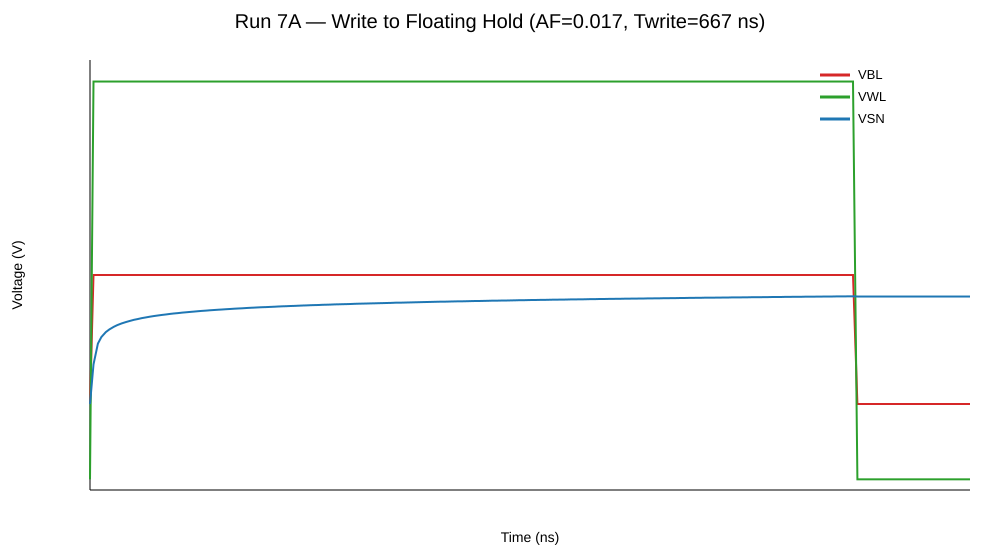
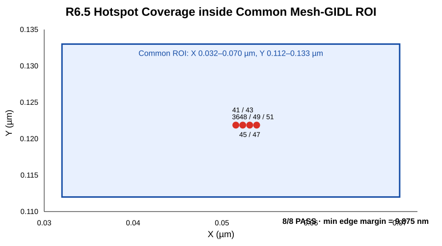
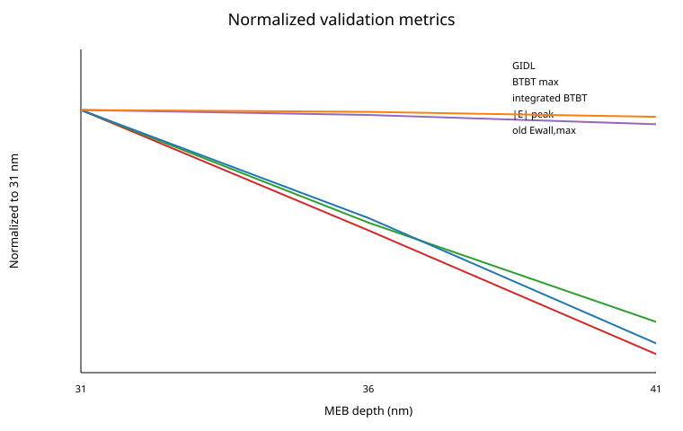
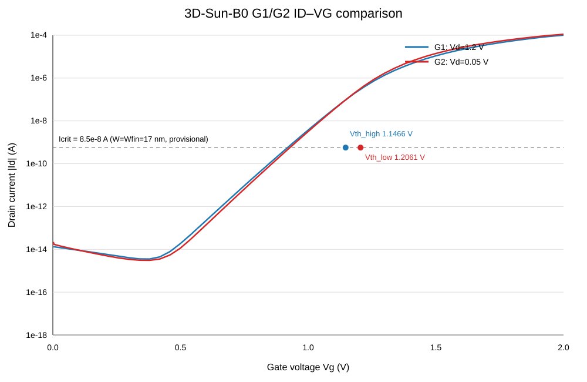

# CMP: GIDL–Retention Translation and Temperature-Dependent MEB Design Range in 20 nm-Class BCAT DRAM

> **Project status:** Run 0–6.5 completed / presentation-feedback validation substantially closed  
> **Current step:** Run 7 — 300 K Write→Hold→Read PASS, 300/340/380 K normalized Hold completed, final retention metric in progress  
> **Tool:** Synopsys Sentaurus TCAD T-2022.03  
> **Main DOE model:** B0 — 20 nm-Class Simplified 2D BCAT  
> **3D validation anchor:** 3D-Sun-B0 — literature-consistent 3D BCAT reconstruction

**Final research topic**  
**20 nm급 BCAT DRAM에서 MEB 깊이에 따른 GIDL–Retention 전달 특성 및 온도 의존적 유효 설계 범위 도출**  
**Temperature-Dependent Effective MEB Design Range Based on GIDL-to-Retention Translation in 20 nm-Class BCAT DRAM**

`MEB Depth → Cgd → Hotspot-resolved Electric Field → GIDL → 1T1C Retention → Effective MEB Design Range`  
`× 300 / 340 / 380 K`  
`+ 233 K cold extension / DWFG transferability = planned validation`

현재까지 B0 baseline 구축, DC metric freeze, mesh convergence, NonlocalPath BTBT/GIDL 검증,
formal MEB screening, 5-level MEB–Cgd–field–GIDL correlation, 300/340/380 K elevated-temperature robustness,
**Run 6.5 extended-MEB boundary closure**, 그리고 1차 발표 이후 hotspot/mesh·E-field·3D baseline·RWL feedback validation까지 진행했습니다.
Run 7에서는 300 K integrated Write→Hold→Read와 300/340/380 K approximately normalized direct-Hold까지 확보했으며,
final retention metric과 MEB-to-cell translation은 계속 진행 중입니다.

- **P1 = 41 nm**: historical initial screened-window candidate
- **P2 = 48 nm**: transistor-level electrostatic/GIDL candidate selected for cell-level retention validation
- **49 nm**: primary cell-level challenger / sensitivity point
- **51 nm**: low-current/background-sensitive boundary reference

P2는 global/final/production optimum을 의미하지 않습니다.
최종 목표는 단일 minimum point를 고르는 것이 아니라, **GIDL suppression이 1T1C retention으로 전달되고 temperature 및 cell-performance guardrail을 함께 만족하는 유효 MEB depth range를 도출하는 것**입니다.
이후 cold-temperature와 DWFG는 이 MEB range의 **robustness / transferability validation**으로 단계적으로 적용합니다.

## Execution Reference

- [TCAD CMD / Parameter Hub](CMD_HUB.md)
- [Current Run Sheet](docs/RUN_SHEET.md)
- [CMP Master Parameter Table](docs/research/CMP_MASTER_PARAMETER_TABLE.md)
- [Feedback Log](docs/FEEDBACK_LOG.md)
- [Post-Turn-02 Validation Roadmap](docs/research/post_turn02_validation_roadmap.md)

---

## 1. Project Overview

CMP(Chips Master Program)는 첨단분야 혁신융합대학사업단과 숭실대학교 차세대반도체학과가 운영하는
실무 중심 장기 프로젝트 프로그램입니다.

- **Activity period:** 2026.04–2027.01
- **Main area:** DRAM cell transistor / BCAT / TCAD / GIDL / retention / MEB design range
- **Goal:** MEB 변화가 gate–drain coupling, drain-side field 및 GIDL에 미치는 영향을 transistor level에서 정량화하고,
  그 leakage suppression이 실제 1T1C storage-node retention으로 얼마나 전달되는지와 elevated temperature에서 그 전달 효과가 어떻게 달라지는지를 검증한 뒤,
  retention·temperature·cell-performance guardrail을 함께 만족하는 **유효 MEB 설계 범위**를 도출
- **Current focus:** B0=36 nm에서 Run 7 final retention metric을 동결한 뒤, P1=41 nm / P2=48 nm / 49 nm challenger를 이용해
  transistor-level GIDL suppression의 cell-level retention translation을 비교하고, temperature·write/read·RWL guardrail을 함께 반영

초기에는 HBM4·Hybrid Bonding 대응 DRAM 관점에서 프로젝트를 시작했지만,
소자 단위에서 더 명확한 물리적 인과관계와 검증 가능한 변수를 확보하기 위해
연구 범위를 **20 nm급 BCAT DRAM의 MEB-dependent GIDL–Retention 전달 특성과 유효 설계 범위 도출**로 구체화했습니다.

- [주제 재발표 자료 PDF](<CMP_소자공정_송민호(재발표).pdf>)
- [1차·2차 발표 진행 맥락](docs/presentations/README.md)

---

## 2. Research Question and Flow

핵심 질문은 다음과 같습니다.

> **MEB depth 증가에 따른 gate–drain coupling 및 drain-side field 감소가 GIDL을 얼마나 억제하며,
> 이 transistor-level leakage benefit이 실제 1T1C storage-node retention으로 얼마나 전달되는가?
> 또한 300/340/380 K에서 그 전달 효과와 cell-performance guardrail을 함께 고려했을 때,
> 최종적으로 사용할 수 있는 유효 MEB depth range는 어디인가?**

현재 연구 flow:

```text
MEB depth
 ↓
project-internal gate–drain coupling / Cgd
 ↓
drain-side electric field
 ↓
NonlocalPath BTBT / GIDL
 ↓
1T1C write / hold / read
 ↓
storage-node charge loss / retention
 ↓
temperature-dependent comparison
 ↓
effective MEB design range
```

Run 6.5까지는 **MEB → Cgd → drain-side field → GIDL → temperature-dependent transistor-level behavior**를 정량화했습니다.
1차 발표 피드백 이후에는 fixed-cut field 하나에만 의존하지 않고 **BTBT hotspot / active-region spatial E-field**를 추가 검증했습니다.
R7 이후에는 이 transistor-level leakage benefit이 실제 DRAM cell retention으로 얼마나 전달되는지를 검증하고,
최종적으로 retention·temperature·cell-performance를 함께 만족하는 MEB 범위를 평가합니다.

2차 발표 이후 연구 순서는 다음처럼 확장합니다.

```text
SG MEB range
 → temperature robustness (233 / 300 / 340 / 380 K)
 → DWFG transferability
 → selected-point 3D validation
```

여기서 **MEB depth가 계속 main design variable**이며, 233 K와 DWFG는 아직 planned validation입니다.

```text
Conditional extensions after retention validation:
retention result
 ├─ alternate leakage diagnostic
 ├─ local MEB sensitivity / optional robustness extension
 └─ normalized refresh implication
```

Refresh 및 variation-aware robust-window 해석은 retention/variation evidence가 확보된 뒤에만 확장합니다.
유효 MEB design range와 variation-aware robust process window는 구분합니다.

---

## 3. Baseline Model — B0

B0는 양산 DRAM cell의 완전한 3D reproduction이 아니라,
구조·물리 변화의 상대 비교를 위한 **simplified 2D BCAT baseline**입니다.

| Parameter | B0 value |
|---|---:|
| Gate length | 20 nm |
| Recess depth | 120 nm |
| SiO₂ liner | 5 nm |
| Nominal MEB / gate-top depth | 36 nm |
| Junction depth | 48 nm |
| S/D lateral setback | 15 nm |
| Body doping | B, `1×10^17 cm^-3` |
| Source/Drain doping | As, `1×10^20 cm^-3` |
| Gate work function | 4.8 eV |
| Geometry | Simplified 2D, single-WF, rectangular trench |

> `MEB`는 실제 etch process 자체를 simulation한 값이 아니라,
> **metal-gate top depth를 이용한 geometric representation**입니다.

세부 가정과 limitation은 [Model Scope](docs/MODEL_SCOPE.md)를 참고합니다.

1차 발표 피드백 이후에는 별도의 **3D-Sun-B0**를 구축해 literature-oriented 3D BCAT와의 model fidelity를 점검했습니다.
3D reconstruction은 geometry/contact/doping, G0/G1/G2 electrical run, sensitivity, DC mesh convergence까지 완료했지만,
Sun et al.의 absolute Vth / SS / DIBL을 정확히 재현한 calibration model은 아닙니다.

따라서 현재 역할은 다음처럼 분리합니다.

- **2D B0:** dense MEB / temperature / cell-level DOE
- **3D-Sun-B0:** baseline fidelity 및 final selected-point trend validation

---

## 4. Key Terms

| Term | Meaning in this project |
|---|---|
| **BCAT** | Silicon trench 내부에 gate/word line을 매립한 DRAM cell transistor |
| **MEB** | Metal Etch-Back. 현재 모델에서는 결과 형상인 gate-top depth로 표현 |
| **Cgd / Cov** | <code>ACExtract &#124;c(g,d)&#124;</code>를 project-internal gate–drain coupling metric으로 사용. calibrated production Cov는 아님 |
| **Mesh-DC** | DC metric 비교에 선택된 Medium mesh (`Mesh_Code=1`) |
| **Mesh-GIDL** | drain-side BTBT hotspot을 추가 refinement한 mesh (`Mesh_Code=3`) |
| **E_wall,max** | historical fixed-cut metric. `Y=0.116 um`, `X=0.032–0.070 um`에서의 peak <code>&#124;ElectricField&#124;</code> |
| **BTBT hotspot / active region** | 현재 feedback-resolved E-field 해석에서 사용하는 spatial critical-region 기준. 10/20/50% threshold sensitivity를 함께 확인 |
| **3D-Sun-B0** | Sun et al. 구조정보 기반 literature-consistent 3D validation anchor. exact electrical calibration은 아님 |
| **DWFG** | Dual Work-Function Gate. 현재 baseline은 single-WF이며, SG MEB range 도출 이후 transferability validation으로 계획 |
| **GIDL** | NonlocalPath BTBT 기반 project-internal relative leakage metric |
| **P1** | historical initial screened-window candidate = 41 nm |
| **P2** | transistor-level electrostatic/GIDL candidate selected for cell-level retention validation = 48 nm |
| **Lproj** | `max(Jdepth-MEB,0)` depth-projection helper. physical lateral overlap length가 아님 |

---

## 5. Run Progress

| Run | Purpose | Main result | Status |
|---|---|---|---|
| **Run 0** | B0 baseline 구축 | 구조·접촉·도핑·기본 turn-on 검증 | Completed |
| **Run 1** | DC metric freeze | Vth / SS / Ion / DIBL 정의 동결 | Completed |
| **Run 2** | DC mesh convergence | `Mesh-DC = Medium / Mesh_Code 1` 선택 | Completed |
| **Run 3** | BTBT/GIDL feasibility | NonlocalPath + `Mesh-GIDL = Mesh_Code 3` 확립 | Completed |
| **Run 4** | Formal MEB screening | 31/36/41 nm에서 deeper-MEB → lower GIDL | Completed |
| **Run 5A** | Cgd extraction feasibility | 1 MHz / Mesh1 internal Cgd protocol 동결 | Completed |
| **Run 5B** | 5-level correlation | MEB–Cgd–field–GIDL 단조 경향 + P1=41 nm | Completed |
| **Run 6** | Temperature robustness | 300 / 340 / 380 K GIDL + background + DC/field 검증 | Completed |
| **Run 6.5** | Extended MEB boundary closure | 43/45/47/48/49/51 nm 확장, P2=48 nm 선정 | Completed |
| **Run 7** | 1T1C / retention feasibility | 300 K W→H→R PASS + 300/340/380 K ~1 V-normalized direct Hold; final retention metric / Mesh1-3 check pending | **In Progress** |
| **Run 8** | MEB-to-cell retention translation | B0/P1/P2 at 300 K; optional 49 challenger | Planned |
| **Run 9** | Temperature-dependent retention translation | SG-selected MEB candidates across existing 300/340/380 K + planned 233 K cold point | Planned |
| **Run 9.5** | Alternate leakage diagnostic | GIJL-like / junction / background path if needed | Conditional |
| **Run 10** | DWFG / selected-point validation extension | SG-derived MEB range의 DWFG transferability + selected-point 3D check | Planned / Conditional |

전체 기준과 exit gate는 [Current Run Sheet](docs/RUN_SHEET.md)에서 관리합니다.

---

# 6. Run-by-Run Summary

## Run 0 — B0 Baseline

**Purpose:** formal metric이나 GIDL 분석에 들어가기 전에 재현 가능한 nominal BCAT 구조를 만드는 단계입니다.

확인한 항목:

- Silicon / SiO₂ / Nitride material region
- source / drain / gate / substrate 4-contact structure
- P-body 및 abrupt N+ S/D doping
- reference mesh 생성
- SDE → SDevice 연결
- `T=300 K`, `VD=0.05 V`, `VG=0→1.5 V` 기본 NMOS turn-on
- ON-state eDensity / ElectricField / current-density / potential spatial sanity


Run 0의 31/36/41 nm split은 **MEB parameterization development check**이며,
성능 비교용 formal DOE로 사용하지 않았습니다.

**Result:** B0 nominal 36 nm 구조의 geometry–mesh–device simulation flow를 확보했습니다.

→ [Run 0 detailed record](docs/progress/run00_baseline.md)

---

## Run 1 — DC Metric Freeze

**Purpose:** 이후 mesh와 MEB case를 동일한 기준으로 비교하기 위해
Vth / SS / Ion / DIBL extraction rule을 먼저 고정했습니다.

| Metric | Internal definition |
|---|---|
| `Vth` | <code>&#124;Id&#124; = 1e-9 A</code> semilog interpolation |
| `SS` | <code>1e-14 ≤ &#124;Id&#124; ≤ 1e-10 A</code> 구간 <code>log10(&#124;Id&#124;)</code> linear fit |
| `Ion` | `VG=1.5 V`, `VD=1.0 V`의 <code>&#124;Id&#124;</code> |
| `DIBL` | `(Vth@0.05V - Vth@1.0V) / 0.95` |
| DC Ioff | BTBT-off numerical-floor diagnostic only — GIDL로 사용하지 않음 |

Run 1에서 고정한 것은 **bias / output / extraction definition**입니다.
Solver `VG_MaxStep`은 이후 numerical convergence 목적에 맞게 조정할 수 있도록 분리했습니다.

**Result:** 이후 Run에서 재사용 가능한 common DC comparison rule을 확보했습니다.

→ [Run 1 detailed record](docs/progress/run01_dc_metric_freeze.md)

---

## Run 2 — DC Mesh Convergence

**Purpose:** 계산량을 과도하게 늘리지 않으면서 DC metric이 수렴하는 base mesh를 선택했습니다.

| Mesh | Points | Elements | Decision |
|---|---:|---:|---|
| Coarse | 1,456 | 3,187 | DC 차이가 커서 제외 |
| **Medium** | **4,571** | **9,657** | Selected |
| Fine-local | 4,993 | 10,513 | Medium과 거의 동일 |

Medium → Fine-local 차이:

- Vth: 약 `0.05–0.06 mV`
- SS: 약 `0.01–0.02 mV/dec`
- Ion: 약 `0.069%`
- DIBL: 약 `0.006 mV/V`


**Selected Mesh-DC — Medium / Mesh_Code 1**


추가로 drain-side wall, junction, trench-bottom E-field cut을 비교해
주요 field profile과 peak 위치도 Medium/Fine-local에서 큰 차이가 없는지 확인했습니다.

**Result:** 이후 DC 비교용 mesh를 **`Mesh-DC = Medium / Mesh_Code 1`**로 선택했습니다.

> 이 결정은 DC metric용입니다. BTBT/GIDL에는 별도의 physics-specific mesh를 사용합니다.

→ [Run 2 detailed record](docs/progress/run02_mesh_convergence.md)

---

## Run 3 — BTBT/GIDL Feasibility + Mesh-GIDL

**Purpose:** simplified B0 구조에서 NonlocalPath BTBT를 이용한
project-internal GIDL 비교 path가 실제로 usable한지 검증했습니다.

```text
BTBT OFF numerical-floor check
        ↓
NonlocalPath ON
        ↓
Band2BandGeneration hotspot
        ↓
drain-side local mesh refinement
        ↓
bias search
        ↓
final ON/OFF attribution
```

Run 3에서 drain-side gate/junction 부근에 localized `Band2BandGeneration`이 확인되어,
Medium base mesh 위에 hotspot refinement를 추가했습니다.

```text
Mesh-GIDL / Mesh_Code 3
X = 0.032–0.070 um
Y = 0.112–0.133 um
local max/min = 1.0 / 0.25 nm
```

| Final Mesh-GIDL full structure | Band2BandGeneration location |
|---|---|
|  |  |

위 이미지는 **hotspot이 어디에 형성되고, 왜 해당 drain-side 영역에 local refinement를 추가했는지**를 시각적으로 보여줍니다.

Final internal GIDL protocol:

```text
T = 300 K
VD = 1.2 V
VG = 0 → -0.7 V
requested output = 5 mV
Band2Band(Model=NonlocalPath)
metric = |Idrain| @ VG=-0.7 V
```

Nominal 36 nm:

| Case | <code>&#124;Idrain&#124; @ VG=-0.7 V</code> |
|---|---:|
| BTBT ON | `1.3777737e-14 A` |
| BTBT OFF | `4.2880983e-16 A` |
| ON/OFF magnitude ratio | **32.13×** |


**Result:** relative GIDL 비교가 가능한 internal protocol과
physics-specific **`Mesh-GIDL = Mesh_Code 3`**를 확보했습니다.

→ [Run 3 detailed record](docs/progress/run03_btbt_gidl_feasibility.md)

---

## Run 4 — Formal MEB 3-Level Screening

**Purpose:** development check와 분리된 fresh formal DOE로
31 / 36 / 41 nm MEB를 다시 실행해 GIDL 변화와 DC penalty를 확인했습니다.

### GIDL result

| MEB | <code>&#124;Idrain&#124; @ VG=-0.7 V</code> | Normalized |
|---:|---:|---:|
| 31 nm | `1.9624468e-14 A` | 1.424361 |
| 36 nm | `1.3777737e-14 A` | 1.000000 |
| 41 nm | `7.7683012e-15 A` | 0.563830 |


31 → 41 nm에서 **deeper MEB direction이 internal GIDL을 지속적으로 낮췄습니다.**

동시에 Run 1의 DC metric으로 Vth / SS / Ion / DIBL을 비교했을 때
현재 model resolution에서는 material penalty가 확인되지 않았습니다.

- Ion change: 약 `0.021%`
- DIBL change: 약 `0.027 mV/V`
- 41 nm는 screened set 중 lowest-GIDL point이지만 global optimum으로 해석하지 않음

**Result:** Run 5에서 gate–drain coupling과 field를 추가로 확인할 가치가 있는
명확한 MEB–GIDL direction을 확보했습니다.

→ [Run 4 detailed record](docs/progress/run04_meb_screening.md)

---

## Run 5 — Cgd Validation + Formal 5-Level Correlation

Run 5는 Run 4의 trend를 단순히 반복하는 대신,
**MEB-dependent GIDL 변화를 설명할 수 있는 intermediate evidence**를 추가하는 단계입니다.

### Run 5A — Cgd extraction protocol

Sentaurus Device `ACCoupled` / `ACExtract`를 이용해 four-terminal capacitance matrix를 생성했습니다.

Formal internal comparison:

```text
T = 300 K
VD = 1.2 V
VG = -0.70 V
f = 1 MHz
Mesh_Code = 1
BTBT = OFF

primary = |c(g,d)|
cross-check = |c(d,g)|
```
- 100 kHz / 1 MHz / 10 MHz sensitivity: 사실상 변화 없음
- Mesh_Code 1 ↔ 2 difference: 약 `0.27%`
- 따라서 **1 MHz + Mesh_Code 1**을 Run 5 internal Cgd protocol로 선택

> Cgd는 calibrated production-cell Cov가 아니라 **raw project-internal AC matrix metric**입니다.

### Run 5B — Formal 5-level MEB screening

| MEB | Norm. Cgd | Norm. `E_wall,max` | Norm. GIDL |
|---:|---:|---:|---:|
| 31.0 | 1.092273 | 1.004646 | 1.424361 |
| 33.5 | 1.046269 | 1.002227 | 1.228068 |
| 36.0 | 1.000000 | 1.000000 | 1.000000 |
| 38.5 | 0.952479 | 0.994983 | 0.765767 |
| 41.0 | 0.904957 | 0.987624 | 0.563830 |

31 → 41 nm:

- `|Cgd|` 약 **17.15% 감소**
- fixed drain-side `E_wall,max` 약 **1.69% 감소**
- GIDL 약 **60.42% 감소**
- Vth / SS / Ion / DIBL: 현재 internal protocol에서 material penalty 미확인


**Interpretation:** MEB 증가에 따라 Cgd, fixed drain-side wall field, GIDL이 같은 단조 감소 방향을 보였습니다.
이는 MEB-dependent coupling/electrostatics가 GIDL 저감 방향과 일치한다는 해석을 지지합니다.

단, 이 five-point correlation은 **direct causality proof가 아닙니다.**
또한 후속 presentation-feedback validation에서 fixed `E_wall,max` 하나만으로는 큰 GIDL 변화를 충분히 설명하기 어렵다는 점을 확인해,
현재 primary mechanism interpretation은 **BTBT hotspot / active-region spatial analysis**로 확장했습니다.

**Result:** 현재 screened window에서는 **P1 = 41 nm**를
`provisional low-GIDL candidate`로 Run 6에 전달합니다.

→ [Run 5 detailed record](docs/progress/run05_cov_gidl_correlation.md)

---

## Run 6 — Elevated-Temperature Robustness

**Purpose:** Run 5에서 선정한 `P1=41 nm`의 low-GIDL direction이
300 / 340 / 380 K fixed-temperature condition에서도 유지되는지 확인했습니다.

Run 6는 self-heating이나 heat transport를 직접 계산한 electrothermal simulation이 아니라,
동일한 frozen device physics에서 lattice temperature만 변경한 **isothermal robustness evaluation**입니다.

### GIDL temperature result

| Temperature | 36 nm ON | 41 nm ON | 41 nm reduction vs 36 nm |
|---:|---:|---:|---:|
| 300 K | `1.378e-14` | `7.768e-15` | `43.6%` |
| 340 K | `2.060e-14` | `1.148e-14` | `44.2%` |
| 380 K | `7.279e-14` | `6.049e-14` | `16.9%` |

`31 > 36 > 41 nm` ranking은 세 temperature에서 모두 유지됐습니다.
41 nm의 total-current advantage는 340 K까지 약 44% 수준으로 유지되지만,
380 K에서는 약 17%로 감소합니다.


R6B BTBT-OFF control에서는 380 K에서 background fraction이
36 nm 약 **62.5%**, 41 nm 약 **75.4%**까지 증가했습니다.
따라서 380 K의 total-current separation 감소는 fixed-wall field advantage가 사라져서라기보다,
BTBT-OFF background contribution이 커지면서 total leakage balance가 변한 결과와 일치합니다.

한편 `E_wall,max`는 300→380 K에서 약 0.9% 정도만 감소했고,
41 nm는 36 nm보다 약 1.24–1.27% 낮은 field를 계속 유지했습니다.
DC thermal guardrail에서도 Vth / SS / Ion / DIBL의 temperature shift는 크지만,
36 nm와 41 nm의 변화는 거의 동일해 **P1에 의한 추가 thermal DC penalty는 확인되지 않았습니다.**


**Result:** `P1=41 nm`는 Run 6 당시 31–41 nm screened window의 provisional candidate로 유지되었습니다.
Run 6 자체는 retention time이나 refresh reduction을 검증한 단계가 아닙니다.

→ [Run 6 detailed record](docs/progress/run06_temperature_robustness.md)

---

## Run 6.5 — Extended MEB Boundary Closure

**Purpose:** Run 5/6의 `P1=41 nm`가 이전 sweep의 최저-GIDL point이면서 동시에 search boundary였기 때문에,
MEB를 더 깊은 영역까지 확장해 41 nm 이후의 trend와 `Jdepth=48 nm` 근처 구조적 boundary를 검증했습니다.

| P2 = 48 nm full geometry | P2 = 48 nm Band2BandGeneration hotspot |
|---|---|
|  |  |

48 nm는 simplified 2D geometry에서 `GateTop≈Jdepth`가 되는 해석 가능한 structural boundary이며,
drain-side gate/junction 부근의 BTBT hotspot은 기존 Mesh-GIDL refinement 영역 안에 유지됩니다.

Extended set:

```text
36 / 41 / 43 / 45 / 47 / 48 / 49 / 51 nm
```

### 300 K endpoint summary

| MEB | GIDL ON (A) | <code>&#124;Cgd&#124;</code> | `E_wall,max` (V/cm) |
|---:|---:|---:|---:|
| 36 | `1.3777737e-14` | `1.6829628e-16` | 867936.60 |
| 41 | `7.7683012e-15` | `1.5230092e-16` | 857194.93 |
| 43 | `5.6821e-15` | `1.4596929e-16` | 850925.62 |
| 45 | `3.9345e-15` | `1.3975704e-16` | 842971.43 |
| 47 | `2.0128e-15` | `1.3367808e-16` | 832607.27 |
| 48 | `1.9375e-15` | `1.3065280e-16` | 825733.44 |
| 49 | `1.8860e-15` | `1.2768057e-16` | 818162.50 |
| 51 | `3.2571e-16` | `1.2192450e-16` | 802740.97 |


**Verified:**

- project-internal Cgd는 51 nm까지 단조 감소
- formal `E_wall,max`도 51 nm까지 단조 감소
- field peak X는 MEB 증가와 함께 deeper direction으로 이동
- stable terminal GIDL suppression은 47–49 nm 영역까지 확인
- 48/49/51 nm의 300 K DC guardrail에서 material penalty는 현재 모델 기준으로 확인되지 않음
- 48/49 nm의 thermal DC 역시 차이가 매우 작음
- 380 K에서는 BTBT-OFF/background contribution이 total leakage의 대부분을 차지

**Important interpretation update:**

48 nm에서 Cgd나 field가 saturation한다는 주장은 사용하지 않습니다.
`GateTop≈Jdepth=48 nm`는 **model-internal structural boundary**이지,
Cgd/field minimum이나 production-process optimum이 아닙니다.

51 nm의 terminal endpoint는 low-current/background-sensitive 영역에 접근하므로
단독 endpoint만으로 “best design”을 주장하지 않습니다.

### Candidate freeze

```text
P1 = 41 nm
historical initial screened-window candidate

P2 = 48 nm
extended-MEB structural-boundary knee candidate for retention handoff

49 nm
primary challenger / sensitivity point

51 nm
low-current/background-sensitive boundary reference
```

48 nm는 absolute minimum Cgd/Ewall/current라서 선택한 것이 아니라,
강한 GIDL suppression, 47–49 nm low-current region 진입, no material DC penalty,
300 K ON/OFF separation, 그리고 `GateTop≈Jdepth`라는 해석 가능한 structural boundary를
동시에 만족하는 **retention handoff point**이기 때문에 선택했습니다.

추가 feedback에서는 3D W cross-section 기반 normalized `1/A_W` RWL proxy를 계산했습니다.
47–49 nm에서는 GIDL의 incremental benefit이 작아지는 반면 RWL proxy penalty는 계속 증가해,
최종 range는 GIDL minimum만으로 정할 수 없다는 trade-off가 확인되었습니다.



→ [Run 6.5 detailed record](docs/progress/run06_5_deeper_meb_boundary.md)

---

## Run 7 — 1T1C Cell Operation / Retention Metric Freeze

**Purpose:** transistor-level GIDL suppression이 실제 storage-node behavior로 전달되는지를 보기 전에,
B0=36 nm에서 write / hold / read와 retention extraction protocol을 먼저 고정하는 단계입니다.

현재 실행된 reference condition:

```text
MEB         = 36 nm
AreaFactor  = 0.017
Ccell       = 10 fF
VBL_WRITE   = 1.2 V
VWL_ON      = 3.0 V
```

300 K에서는 약 **667 ns** write 후 storage node를 약 1 V로 normalization했고,
direct floating Hold, independent Read, integrated **Write → Hold → Read**까지 확인했습니다.



Temperature별 write time을 조정해 Hold 시작전압을 약 1 V로 맞춘 결과:

| Temperature | Twrite | Direct-Hold start |
|---:|---:|---:|
| 300 K | 667 ns | 1.000017733 V |
| 340 K | 258 ns | 1.000107421 V |
| 380 K | 126.54 ns | 1.000272165 V |

100 μs direct Hold에서의 voltage loss:

| Temperature | ΔVSN @ 100 μs |
|---:|---:|
| 300 K | 0.270195 μV |
| 340 K | 0.483889 μV |
| 380 K | 7.438961 μV |

380 K의 transient-equivalent leakage scale은 300 K 대비 약 **27.5×**입니다.
다만 이 값은 **short-window direct-transient trend**이며, physical retention time을 직접 측정한 값은 아닙니다.

300 K integrated W→H→R에서는 tested Hold window에서 약 **+35.625 mV** D1 bitline signal을 유지했습니다.
현재 `VSN=0.8 V`에서도 D1 signal이 존재하므로, 0.8 V는 현재 모델의 read-failure point가 아니라 retention comparison criterion입니다.

### Run 7에서 새로 확인된 guardrail

현재 1 V storage-node write를 위해 `VWL_ON=3.0 V`가 필요합니다.
따라서 앞으로는 “1 V 도달”만으로 write success를 판단하지 않고,

```text
VWL → VSN
+ write time
+ Ion / Vth
+ read margin
+ leakage / retention
+ MEB dependence
```

를 함께 확인합니다.

아직 남은 항목:

- leakage-vs-V / final retention metric
- retention-specific Mesh1 vs Mesh3 numerical check
- formal MEB-to-cell retention comparison

→ [Run 7 detailed record](docs/progress/run07_1t1c_retention_feasibility.md)

---

## 7. Presentation Feedback / Validation

1차 발표 이후 기존 Run 결과를 버리지 않고,
**측정 방법·model fidelity·cell-level protocol을 보강하는 validation branch**를 추가했습니다.

### 7.1 Hotspot / Mesh validation

36 / 41 / 43 / 45 / 47 / 48 / 49 / 51 nm 전체 R6.5 set에서
independently extracted BTBT hotspot이 동일 Mesh-Code 3 ROI 내부에 유지되는지 확인했습니다.

- ROI coverage: **8/8 PASS**
- `Yhot = 0.121875 um`: 8/8 case
- 36→51 nm `Xhot` movement: 약 **+2.344 nm**
- minimum nearest ROI-edge margin: **9.875 nm**



이는 **comparison consistency / hotspot coverage**를 지지하며,
모든 local BTBT quantity의 absolute mesh independence를 의미하지는 않습니다.

### 7.2 E-field measurement update

기존 fixed `Y=0.116 um`의 `E_wall,max`는 reproducible historical metric으로 유지합니다.
다만 31→41 nm에서 terminal GIDL은 약 60.42% 감소하는데 fixed-wall peak field 변화는 약 1.69%에 불과해,
실제 BTBT critical region을 따라가는 spatial validation을 추가했습니다.

31 → 41 nm:

| Metric | Change |
|---|---:|
| Terminal GIDL | **-60.42%** |
| BTBTmax | **-52.43%** |
| Hotspot-cut `|E|` peak | **-3.52%** |
| 20% BTBT-active width | **-12.68%** |
| 20% active-region `∫|E|dx` | **-14.68%** |
| Full-cut 1-D `∫GBTBT dx` | **-57.74%** |
| 20% region `∫GBTBT dx` | **-58.40%** |



현재 해석은 single peak보다 **BTBT generation amplitude + active spatial extent + regional field distribution**을 함께 보는 방향입니다.
20% criterion은 universal literature standard가 아니라 10/20/50% sensitivity 중 representative middle value입니다.

### 7.3 3D baseline fidelity

Sun et al. 구조정보를 바탕으로 별도 `3D-Sun-B0` reconstruction을 구축했습니다.



Geometry / contact / doping / DC mesh는 validation anchor로 사용할 수 있는 수준까지 정리했지만,
paper의 absolute Vth / SS / DIBL과 mismatch가 남아 있습니다.

따라서:

```text
2D B0
= dense relative DOE

3D-Sun-B0
= literature-consistent validation anchor
= final selected-point trend check
```

로 역할을 분리합니다.

### 7.4 Second-presentation feedback

2차 발표 이후 추가된 항목은 아직 **completed result가 아니라 next validation**입니다.

- **High-WL bias:** `VWL_ON=3.0 V → VSN≈1 V`를 write-transfer guardrail로 분석
- **Cold temperature:** `233 K (-40 °C)` 추가 예정
- **DWFG:** 20 nm single-WF baseline을 유지한 채, SG에서 도출한 MEB candidate/range를 DWFG에서도 재검증

현재 roadmap:

```text
SG MEB range
 → Temperature robustness
 → DWFG transferability
 → Selected-point 3D validation
```

→ [Feedback Log](docs/FEEDBACK_LOG.md)  
→ [Post-Turn-02 Validation Roadmap](docs/research/post_turn02_validation_roadmap.md)

---

## 8. Current Evidence Status

### Verified

- B0 simplified 2D BCAT geometry와 SDE–SDevice flow
- DC metric definition / Mesh-DC convergence
- NonlocalPath BTBT/GIDL feasibility와 Mesh-GIDL
- 31–41 nm formal MEB screening
- Run 5 internal Cgd extraction / 5-level MEB trend
- 300 / 340 / 380 K transistor-level GIDL ranking 및 background 변화
- Run 6.5 extended 36/41/43/45/47/48/49/51 nm transistor-level evidence
- full R6.5 common Mesh-GIDL ROI coverage: 8/8 PASS
- hotspot-following / active-region E-field–BTBT feedback validation
- 3D-Sun-B0 literature-consistent reconstruction 및 2D↔3D fidelity close-out
- 3D W-area 기반 normalized RWL proxy trade-off checkpoint
- Run 7 300 K Write→Hold→Read feasibility
- Run 7 approximately normalized 300/340/380 K direct-Hold temperature trend

### Supported Interpretation

```text
MEB increase
 → project-internal gate–drain coupling decrease
 → drain-side BTBT-critical region의 field / generation redistribution
 → terminal GIDL suppression
 → cell-level retention benefit 가능성
```

Run 5의 fixed-wall metric과 five-point correlation은 historical/descriptive evidence로 유지합니다.
현재 E-field mechanism 해석은 **hotspot / BTBT-active-region spatial evidence**를 primary supporting evidence로 사용합니다.

### Not Yet Verified

- calibrated production-cell temperature-dependent Cov / GIDL
- electrothermal self-heating / heat transport
- exact Sun-et-al. absolute electrical reproduction
- final physical retention-time metric
- MEB-dependent 1T1C retention improvement
- refresh burden reduction
- 233 K cold-condition result
- DWFG result / SG-DWFG common MEB range
- final temperature-dependent effective MEB design range
- variation-aware robust process window
- global/final/production optimum

---

## 9. Next Step — R7+ Cell-Level Translation and MEB Range Derivation

가장 먼저 Run 7의 final retention metric과 retention-specific numerical check를 닫습니다.
그 뒤 기존 run numbering을 유지하면서 다음 순서로 진행합니다.

```text
Run 7
B0=36 nm
→ final retention metric freeze
→ high-WL write-transfer guardrail 정리

Run 8
36 / 41 / 48 nm @ 300 K
49 nm = primary challenger
→ MEB-to-cell retention translation
→ SG effective MEB candidate / range

Run 9
SG-selected candidates
→ 300 / 340 / 380 K
→ + planned 233 K cold point
→ temperature robustness / retention translation

Run 10 / extension
SG-selected MEB candidates
→ DWFG transferability
→ hotspot relocation / Mesh ROI recheck
→ selected-point 3D validation
```

핵심은 **single-WF 20 nm BCAT에서 MEB range를 먼저 도출한 뒤**,
temperature와 DWFG를 별도의 validation axis로 붙이는 것입니다.

DWFG 때문에 기존 single-WF 연구를 폐기하거나 15 nm ICEIC 구조를 새 baseline으로 교체하지 않습니다.
SG와 DWFG의 최적 범위가 다르면 공통범위를 억지로 만들지 않고,
**DWFG 적용 시 optimum MEB range가 이동한다**는 결과로 해석합니다.

최종 synthesis:

```text
GIDL suppression
+ 1T1C retention
+ write/read feasibility
+ temperature robustness
+ RWL structural penalty
+ DWFG transferability (when executed)
+ selected-point 3D trend validation
→ Effective MEB Design Range
```

Run 6.5까지의 transistor-level leakage 결과만으로 retention, refresh reduction,
233 K behavior, DWFG superiority, robust process window를 주장하지 않습니다.

---

## 10. Repository Structure

```text
CMP/
├─ README.md
├─ CMD_HUB.md
├─ CMP_소자공정_송민호(재발표).pdf
├─ docs/
│  ├─ RUN_SHEET.md
│  ├─ MODEL_SCOPE.md
│  ├─ DECISIONS.md
│  ├─ FEEDBACK_LOG.md
│  ├─ REFERENCES.md
│  ├─ evidence/
│  ├─ presentations/
│  ├─ research/
│  └─ progress/
├─ code/
│  ├─ sde/
│  ├─ sdevice/
│  └─ scripts/extraction/
├─ data/
│  ├─ baseline_3d_sun_b0/
│  ├─ run00/ ... run07/
│  └─ tradeoff/
└─ assets/images/
   ├─ run00/ ... run07/
   └─ feedback/
```

`.tdr`, `.plt`, full `.log`, `.out`, `.job`은 local archive에 보관하고,
GitHub에는 source code, conditions, CSV, processed summary, selected evidence를 중심으로 기록합니다.

---

## 11. Model Scope and Limitations

이 저장소의 결과는 **relative comparison을 위한 academic TCAD study**입니다.

- main DOE는 simplified 2D BCAT이며 production-cell absolute calibration이 아닙니다.
- 3D-Sun-B0는 literature-consistent validation anchor이며 Sun et al.의 absolute electrical calibration을 정확히 재현한 model은 아닙니다.
- terminal current는 production-cell absolute current로 calibration되지 않았습니다.
- Cgd는 raw project-internal AC matrix element입니다.
- NonlocalPath GIDL은 relative internal metric입니다.
- historical `E_wall,max`는 fixed-cut metric이며 global Emax가 아닙니다.
- current E-field interpretation은 hotspot / BTBT-active-region spatial evidence를 함께 사용합니다.
- 20% BTBT-active criterion은 CMP representative metric이지 universal literature standard가 아닙니다.
- `Lproj`는 physical lateral overlap length가 아닙니다.
- `GateTop=Jdepth`는 model-internal structural boundary입니다.
- RWL 결과는 geometry-derived normalized proxy이며 actual distributed WL resistance / RC delay가 아닙니다.
- Run 7 short-window direct Hold는 physical retention time을 직접 측정한 값이 아닙니다.
- `VWL_ON=3.0 V`는 current write-feasibility condition이면서 동시에 unresolved write-transfer guardrail입니다.
- `P1=41 nm`는 historical initial screened-window candidate입니다.
- `P2=48 nm`는 cell-level retention validation을 위한 transistor-level candidate이며 global/final/production optimum이 아닙니다.
- 233 K와 DWFG는 planned validation이며 아직 completed result가 아닙니다.
- 최종 유효 MEB 설계 범위는 cell-level retention / temperature / write-read / structural-penalty evidence 이후에만 동결합니다.

상세 기준은 [Model Scope](docs/MODEL_SCOPE.md), [Decisions](docs/DECISIONS.md), [Feedback Log](docs/FEEDBACK_LOG.md)를 참고합니다.

---

## 12. References

- M. Sun, H. W. Baac, and C. Shin,  
  “Simulation Study: The Impact of Structural Variations on the Characteristics of a Buried-Channel-Array Transistor (BCAT) in DRAM,”  
  *Micromachines*, 2022. [DOI](https://doi.org/10.3390/mi13091476)

- S. K. Jang and S. Y. Kim,  
  “Impact of Metal and Poly Gate Thickness on GIDL in DRAM Dual Work-Function Structures,”  
  *ICEIC*, 2026. [DOI](https://doi.org/10.1109/ICEIC69189.2026.11386251)

Retention / 1T1C / Dual-WF / process-variation 관련 확장 참고문헌은
[References](docs/REFERENCES.md)를 확인합니다.

---

## License / Usage Note

본 저장소는 학술 목적의 TCAD 연구 진행 과정을 기록합니다.
Synopsys Sentaurus input deck은 교육·연구용 문서화 목적으로 포함되며,
Synopsys software 및 proprietary model implementation은 각 라이선스 정책을 따릅니다.