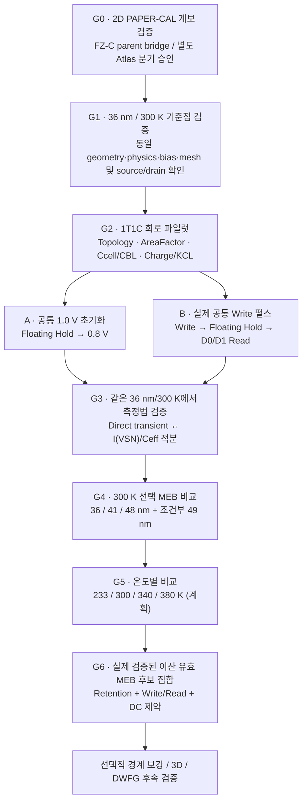

# CMP — 2D PAPER-CAL → 1T1C Retention 검증 로드맵

> **Status: PROVISIONAL / NOT FROZEN** — 2026-10-08  
> **승인된 방향:** 1T1C Retention을 **A: 공통 초기 상태 Retention** + **B: 실제 Write→Hold→Read** 두 방법으로 모두 평가.  
> **미동결:** 물리·회로 수치, 파형, Write/Read 합격 기준, Hold bias 채택, Retention 계산 방법의 검증 완료 여부, 최적 MEB 및 유효 범위.  
> 이 문서는 기존 2D PAPER-CAL 검증 중 후속 1T1C 요구를 미리 고려하기 위한 **연구 설계 스케치**다. 별도의 TCAD 실행 승인이나 공식 Run/Freeze 개정이 아니다.

## 1. 연구 질문과 한눈에 보는 진행 방향

**연구 질문:** 20 nm급 single-WF BCAT에서 MEB 깊이가 바꾸는 전계·BTBT 및 GIDL 관련 누설의 차이가 실제 1T1C 저장 노드 Retention으로 전달되는가? 해당 결과가 Write/Read와 온도 조건을 고려한 *유효 MEB 후보 집합*으로 이어지는가?

- **[CMP-EXECUTED]** 15-point 300 K Atlas의 동일 수치 분기 내부 QC 및 분석은 완료. 2026-10-05 **FZ-C executed-parent와의 정확한 연결은 아직 OPEN**.
- **[CMP-EXECUTED / LEGACY]** 기존 Run-7(36 nm)의 Write, short-Hold, D0/D1 Read 및 일부 온도 검증은 NonlocalPath 계열의 역사적 근거. 현행 PAPER-CAL/Hurkx 동작을 보증하지 않는다.
- **[PLANNED]** 신규 PAPER-CAL 분기의 cell-level Retention, MEB별 Write/Read 및 온도별 유효 구간은 아직 실행 전.
- **실제 다음 첫 과제는 G0.** 정확한 bridge를 복구하거나, 현행 Atlas를 *명시적으로 독립 라벨을 붙인 작업 분기*로 계속할지 사용자 결정을 거쳐야 한다. 문서 커밋만으로 G0가 해결되지 않는다.
- 기존 Atlas 15점의 전 항목 반복 실행은 기본 계획이 아니다. 36 nm/300 K 통제점이 우선.

## 2. 기존 2D 베이스라인 검증에 반영할 항목

| 베이스라인 검증 영역 | 1T1C를 위해 기록·확인할 내용 | 해석 제한 |
|---|---|---|
| Geometry/Contact | 소자 격자의 source↔BL, drain↔SN, gate↔WL, substrate↔reference 매핑 | GIDL hotspot 위치와 실제 SN측을 구분 |
| Model/Lineage | 동일 PAPER-CAL SDE·SDevice·Hurkx ON/OFF·mesh·bias·temperature·extraction | NonlocalPath 역사적 결과와 절대 수치 혼합 금지 |
| Write 방향 DC/전계 | BL 고전압 인가 시 소자 접합의 고전계 및 charging 특성; Ion, Vth, SS, DIBL | Write 중 가장 높은 전계가 언제나 SN쪽이라는 가정 금지 |
| GIDL/Hold | Atlas의 GIDL 시험 `VD=1.2, VG=-0.7`과 실제 `VSN(t)`의 시변 Hold bias 구분 | GIDL 조건 총 Drain 전류 ≠ Floating SN 순손실 전류 |
| Capacitance | Cgd는 coupling 설명 지표, SN의 `Q(VSN)`와 `Ceff(VSN)`는 별도 | Cgd를 셀 Ccell 또는 실측 Cov라고 표현 금지 |
| Numerical/Charge | 2D A/um → 1T1C ampere 환산, `AreaFactor`, KCL 및 전하 보존; Write/Read hotspot·time/mesh check | GIDL mesh 검증이 cell transient 검증까지 보증하지 않음 |
| Provenance | 실행한 parent deck, 단자 부호, 각 단계 bias 및 결과 파일 기록 | 다른 lineage의 시뮬레이션을 하나로 합치지 않음 |

## 3. 1T1C 회로 후보 — 아직 결정된 운영값 아님

Legacy Run-7의 연결 `source→BL, drain→SN, gate→WL, substrate→reference, Ccell:SN→reference`는 국내 MixedMode 1T1C 문헌(방준해 외, 2025)의 방법론 및 기존 CMP 실험 기록과 정합적인 **초기 Topology**다.

| 항목 | 과거 Run-7에서 사용한 값 | 향후 검증 |
|---|---|---|
| Baseline | MEB 36 nm, 300 K | 동일 PAPER-CAL 명목 기준부터 |
| `AreaFactor` | 0.017 (17 nm effective-width proxy) | 2D 전류/전하와 커패시터 일치; 생산 폭/전류 보정 아님 |
| `Ccell` | 10 fF | 1T1C 모사 용량 후보; 양산 실제값 아님 |
| `CBL` | 45 fF | Read charge-sharing 참고값; BL 전체 기생/센스앰프 아님 |
| Write BL | 1.2 V | PAPER-CAL 충전 곡선 확인 |
| Write WL | 1.5 / 2.0 / 2.5 / 3.0 V screening | 3.0 V의 필요성, 기존 전압 검증 영역 및 스트레스 확인 |
| Write duration | 3.0 V에서 약 667 ns로 300 K `VSN≈1.0 V` | 옛 NonlocalPath 36 nm만의 정규화 결과; 현재 계열에서 새로 측정 |
| **H-S Hold stress** | WL −0.7 V, BL 0 V, body 0 V, SN floating | 기존 CMP 누설 스트레스 후보; 제품 standby 조건 아님 |
| **H-L Hold 참고** | Cho et al.(2026): WL −0.2 V, BL +0.5 V, body −0.6 V | 다른 구조의 문헌 bias 예시. 선택적 비교 후보일 뿐 주 조건 채택 **미승인** |
| Read | BL precharge 0.5 V, WL 3.0 V, Read pulse 10 ns | 같은 시각 D0/D1 charge sharing 및 읽기 교란 확인 |

**선결 결정:** H-S/H-L 민감도 비교의 필요성, 주 Hold bias, final Write WL/time, Read pulse/time, `AreaFactor`/capacitance 고정 여부는 36 nm 파일럿 근거가 나온 이후 결정한다.

## 4. 승인된 두 평가 방법: 측정 역할을 분리

### A — 동일 초기 전압 Retention (원인 분리)

- 모든 `(MEB,T)`에서 같은 Hold bias와 실제 **VSN≈1.0 V**에서 시작. Clamp/Set 해제 후 일시적 재평형과 정상 전하 손실을 분리하여 `t0`, `V_SN(t0)`, `Q_SN(t0)`를 기록.
- 핵심 지표는 `RT_1p0_0p8 = t[VSN: 1.0 V → 0.8 V]`. **0.8 V는 분석상의 종료 전압이지 Read failure 기준이 아니다.**
- 우선 직접 Floating-SN transient를 평가. 시간이 너무 길면 동일 Hold state의 `I_loss(VSN)`와 `Ceff(VSN)`를 사용한 적분을 **추정치로 별도 표시**: `t_RET,int = ∫(0.8→1.0) Ceff(V)/I_loss(V) dV`. 부호·기생 전하·유효 capacitance·준정적 전제와 직접 transient의 짧은 겹침 구간을 검증해야 한다.
- 지정 시간 안에 0.8 V에 도달하지 않으면 `t_RET > t_observation`(right-censored). 기존 100 us 전압 감소를 선형 외삽해 확정 retention을 만들지 않는다.
- 주요 출력: 절대 `RT_A(d,T)`, 온도별 `RT_A(d,T)/RT_A(36,T)`, `VSN(t)`, SN 순손실 전류, censoring, 수치 오차.

### B — 실제 Write→Hold→Read (기능 검증)

- 모든 MEB·온도에 **동일한 Write 펄스와 지속시간**을 적용해 `VSN_write_end`, `VSN_hold_start`, `t_reach_1V`(실제로 도달할 때만), 전하 이동·Write time penalty를 측정.
- 실제 Write 후 Floating-SN Hold. A처럼 구조별 Write 시간을 임의 조정해 1 V로 맞추지 않음. 1-V 맞춤 Write 실험은 **추가 메커니즘 비교군**으로만 보고한다.
- 매 Hold 기간마다 독립적인 Write→Hold history로 Read. 같은 `(MEB,T)`에서 D0·D1과 BL precharge/time을 동일하게 설정하고 `ΔVBL_D0`, `ΔVBL_D1`, `ΔV_sep`, `ΔQ_SN_read` 확인.
- 0.8 V에서 D0/D1 Read가 구분되더라도 sense amp/noise/margin budget 없이 **실물 DRAM Read PASS**로 주장하지 않음.
- B의 실제 시작 SN→0.8 V retention과 A의 고정 1.0→0.8 V retention은 **서로 다른 measurand**. 하나의 숫자 또는 순위로 합치지 않음.

## 5. 평가지표 역할 및 유효 범위 판정의 틀

| Group | 지표 | 현재 역할 |
|---|---|---|
| **Primary Outcome** | `RT_A(d,T)`, same-T 36 nm 대비 Retention 비율; B actual-Hold loss | 누설에서 실제 저장 특성으로의 전달 여부 검증 |
| **Functional Guardrail** | Write 종료 SN·충전 시간, D0/D1 charge-sharing `ΔV_sep`, Read disturbance | 설계의 기능적 타당성. 숫자 pass/fail threshold **UNDECIDED** |
| **Device Guardrail** | Ion, Vth, SS, DIBL | DC 성능 유지 확인. 상대 허용 기준 **UNDECIDED** |
| **Mechanism Diagnostic** | Atlas total Drain leakage, Hurkx ON/OFF sensitivity, Cgd, E@BTBT, BTBT spatial integral | 기전 해석, 최종 합격 기준으로 자동 채택 금지 |
| **Conditional** | Geometry RWL proxy, real WL-RC, 3D, DWFG, variation | 추후 조건부 검증. 기하 proxy는 실제 RWL 아님 |

온도 `233/300/340/380 K`는 현행 연구의 **계획된 이산 검증점**이며 PAPER-CAL의 실행 완료 결과가 아니다. 같은 온도 36 nm의 절대 Retention과 상대 비율을 모두 보고한다.

최종 MEB 판정은 **Write/Read와 승인된 DC/Retention 조건을 통과한 이산 실측 깊이 집합**으로부터 시작한다. 측정하지 않은 깊이 전체에 걸친 연속 범위 또는 공정 변동 강건성은 주장하지 않는다.

## 6. 단계별 실행 게이트

| Gate | 작업 | 완료 조건 / 다음 행동 |
|---|---|---|
| **G0** | Exact FZ-C executed-parent와 Atlas bridge | Bridge 확인 **또는** 독립 Atlas label 사용 명시적 사용자 결정. 그렇지 않으면 완료로 표시하지 않음 |
| **G1** | 36 nm/300 K 2D 기준점, source/drain, Hurkx current, mesh/bias 정합 | 새 분기 parent·수치 증거 등록. 전체 15점 기본 재실행 금지 |
| **G2** | 36 nm/300 K PAPER-CAL 1T1C 연결·전하/KCL 및 각 회로 후보 검사 | 모델/AreaFactor/Ccell/Read 및 Hold 후보의 신뢰성 평가. 수치 동결 전 사용자 검토 |
| **G3** | A/B 분리 실행법 검증; direct vs integral, mesh/time, D0/D1 Read | Retention 추출 정의·검열/오차·실제 Read proxy 점검 후 Run-7 프로토콜 승인 |
| **G4** | 300 K 선택 MEB 비교 `36/41/48`; 49 challenger | Cell-level 이득·페널티 평가. 39 특이점/51 경계점은 원인상 필요하면 조건부 |
| **G5** | 승인된 선택 깊이 × 온도 `233/300/340/380` | 각 온도 36 nm 기준 재현 후 비교, 필요시 worst-case 기록 |
| **G6** | 제약 기반 유효 후보집합/Trade-off 분석 | 근거·사용자 승인된 기능/성능 기준만 적용. 범위는 실측 이산 깊이 중심 |

## 7. 보류 및 관리 규칙

- **A+B 병행 방향 외에 새 수치적 성능 기준은 승인되지 않았다.** Retention +25%, Ion ≥95%, Write/Read 페널티 ≤10%, 48 nm 최적, 47~49 nm 유효 범위를 동결하지 않는다.
- 현재 PAPER-CAL Hurkx와 과거 Legacy NonlocalPath의 절대 Retention/전류를 혼합하지 않는다.
- 15점의 300 K Atlas를 무작정 재실행하지 않는다. 물리 calibration knob를 Retention 개선을 위해 재조정하지 않는다.
- SDevice/SWB/MixedMode 코드 변경 또는 실행이 필요하면 closest executed parent를 먼저 확인하고, 신설/변경되는 Set/Unset·Floating·Transient·Physics syntax는 `TCAD_MANUAL_INDEX.md`에서 찾아 **공식 Sentaurus T-2022.03 관련 섹션**으로 확인한다.
- 실제 파일럿 검증이 끝나야 별도 **Evaluation Protocol**, `docs/DECISIONS.md`, RUN_SHEET 및 HANDOFF의 **적절한 부분**에 동결/검증된 내용을 반영한다. 본 문서는 진행 방향의 스냅샷이지 실행 완료 보고가 아니다.

## 8. 근거 문서

- [`AGENTS.md`](../../AGENTS.md) / [`HANDOFF.md`](../../HANDOFF.md) — 현재 상태 및 계보 선결조건.
- [`docs/DECISIONS.md`](../DECISIONS.md) — D-039~D-048 기존 Run-7/후속 검증 역할.
- [`docs/progress/b0_2d_paper_cal_meb_atlas_300k_20261008.md`](../progress/b0_2d_paper_cal_meb_atlas_300k_20261008.md) — Atlas 데이터·QC 증거.
- [`docs/research/b0_2d_production_revalidation_plan.md`](b0_2d_production_revalidation_plan.md) — exact-parent gate.
- [`docs/evidence/run07_retention_manifest.md`](../evidence/run07_retention_manifest.md) / [`code/sdevice/run07/`](../../code/sdevice/run07/) — Legacy 실험조건의 출처.
- [`MEB_EFFECTIVE_RANGE_LITERATURE_REFERENCE.md`](MEB_EFFECTIVE_RANGE_LITERATURE_REFERENCE.md) / [`MEB_EFFECTIVE_RANGE_REVIEW_20261008.md`](MEB_EFFECTIVE_RANGE_REVIEW_20261008.md) — 11편 통합 문헌 정리 및 심층 검토. 원문 PDF 자체와는 구분.
- [`docs/literature/REF08_bang_2025_1t1c.md`](../literature/REF08_bang_2025_1t1c.md) / [`docs/literature/REF09_cho_2026_read_write_hold.md`](../literature/REF09_cho_2026_read_write_hold.md) — 1T1C 연결·Read/Write 문헌 맥락.

**다음 실제 연구 행동:** 새로운 1T1C 전체 매트릭스 시작이 아니라, `HANDOFF.md`의 G0 exact-parent/독립 Atlas 분기 문제를 먼저 결정하고, 이후 36 nm/300 K 단일 셀 파일럿 조건을 승인한다.
